#   **AUTOMATIVE EMBEDDED**

         
     
     
     
     

##  **Table of Contents**
### **Lesson 01: Setting Up Your First Keil µVision Project**  
1. [Install Keil C ARM Package for STM32](#1-install-keil-c-arm-package-for-stm32)  
2. [µVision Software Packs Download and Install](#2-µvision-software-packs-download-and-install)  
3. [Create a New Project](#3-create-a-new-project)  
4. [Add Source Files](#4-add-source-files)  
5. [Configure Project Options](#5-configure-project-options)  
6. [Build the Project](#6-build-the-project)  
7. [Debug (Optional)](#7-debug-optional)  
8. [Download (Optional)](#8-download-optional)  

### **Lesson 02: General-purpose I/Os (GPIO)**  
1. [What is GPIO ?](#1-what-is-gpio)  
2. [What is the GPIO Port ?](#2-what-is-the-gpio-port)   
3. [GPIO Modes](#3-gpio-modes)  
  3.1. [GPIO Output](#31-gpio-output)    
  3.2. [GPIO Input](#32-gpio-input)   
  3.3. [GPIO Input Modes](#33-gpio-input-modes)               
    3.3.1. [High-impedance or Floating](#331-high-impedance-or-floating)    
    3.3.2. [Pull-up](#332-pull-up)  
    3.3.3. [Pull-down](#333-pull-down)  
  3.4. [GPIO Output Modes](#34-gpio-output-modes)  
    3.4.1. [Push-pull](#341-push-pull)  
    3.4.2. [Open-drain](#342-open-drain)  
  3.5. [Analog Mode](#35-analog-mode)  
  3.6. [Alternate Function Mode](#36-alternate-function-mode)  


## Lesson 01: Setting Up Your First Keil µVision Project

This guide outlines the basic steps for creating a new project in Keil µVision, a popular Integrated Development Environment (IDE) for embedded systems development.

### **1. Install Keil C ARM Package for STM32**

Visit the following link to download the package:

https://www.keil.arm.com/packs/stm32f1xx_dfp-keil/boards/

Tài liệu tham khảo: Datasheet, Reference Manual của MCU.

ST-Link driver.

### **2. µVision Software Packs Download and Install**

*   Open the Pack Installer by clicking on its icon: refer to the below image.
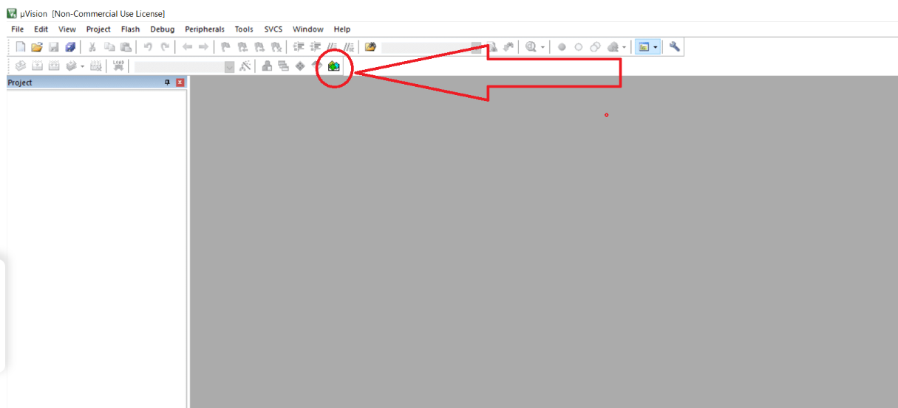
*   A Pack Installer Welcome screen will open. Read and close it.: refer to the below image.
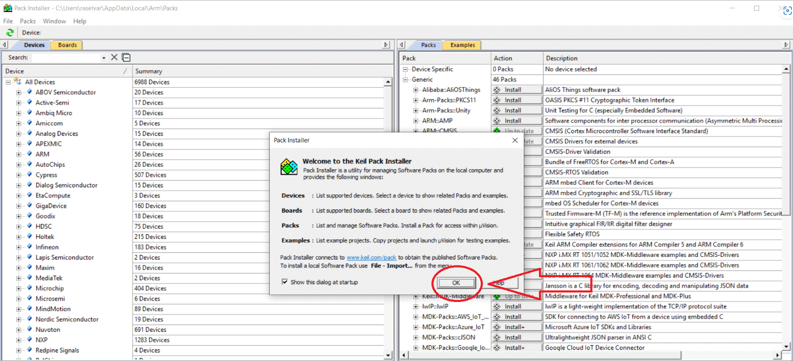
*   Import the required software packs for your target microcontroller.
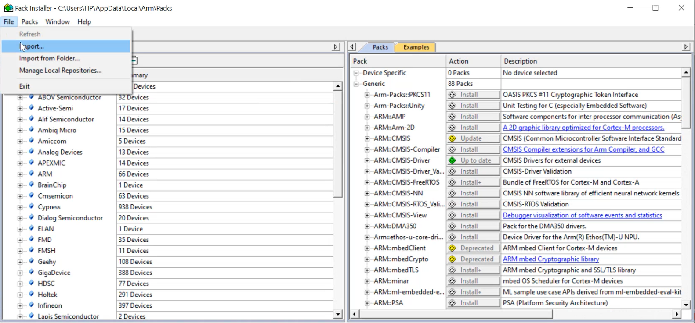
*   Choose and click **0K**.
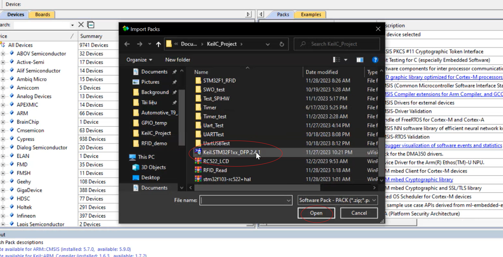

### **3. Create a New Project**

*   Open Keil µVision.
*   Go to **Project** -> **New µVision Project**.
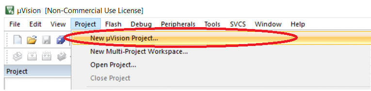
*   Create a new folder and provide the desired project name and click the save button in the window as shown below image. I called it the first_project. You can name anything.
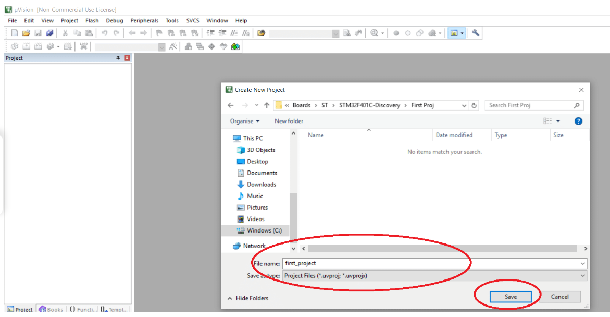
*   Select the target microcontroller (e.g., STM32F103C8T6) from the device database.
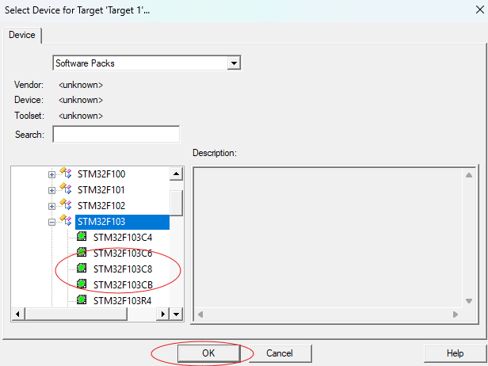
*   Click **OK**.

### **4. Add Source Files**

*   In the **Project** window, right-click on "Source Group 1" and select **Add Files to Group 'Source Group 1'**.
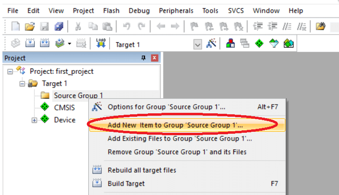
*   Highlight the upper-left icon: C file (.c). And enter your source file’s name. I called it as **main.c**. Please refer to the below image.
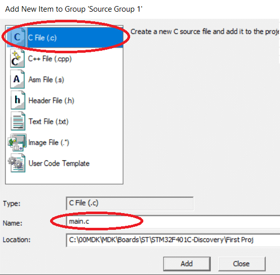
*   Click on Add to close this window.

### **5. Configure Project Options**

*   In the **Project** window, double-click on **Target 1**.
*   Go to **Options for Target 'Target 1'**.
*   **Device:** Verify that the correct device is selected.
*   **Target:** 
    *   **Code Generation:** Configure compiler options (optimization level, warnings, etc.).
    *   **Linker:** Configure linker options (output file name, memory map, etc.).
    *   **Debug:** Configure debug settings (debugger type, communication interface, etc.).
*   **Output:** Configure output options (output file directory, create HEX file, etc.).

### **6. Build the Project**

*   Click on the **Build** button (or press **F7**) to compile and link your project.
*   Check the **Build Output** window for any errors or warnings.

### **7. Debug (Optional)**

*   If you have a hardware debugger connected, you can debug your project.
*   Set breakpoints in your code.
*   Step through the code line by line.
*   Inspect variables and memory.

### **8. Download (Optional)**

*   If you have a hardware target, you can download the compiled code to the target device.

**Note:**

* This is a basic guide. The specific steps and options may vary depending on the microcontroller you are using and your project requirements.
* Refer to the Keil µVision documentation for detailed information and advanced features.

**Example Source Code (main.c):**

```c
#include <stdio.h>

int main(void)
{
    // Your code here
    printf("Hello, world!\n");

    while(1); // Infinite loop

    return 0;
}
```

## Lesson 02: General-purpose I/Os (GPIO)

### **1. What is GPIO**

*   GPIO (General-Purpose Input/Output) là một trong những thuật ngữ thường gặp nhất mà bạn có thể gặp phải trong lĩnh vực nhúng. GPIO là một chân tín hiệu trên một mạch tích hợp hoặc bo mạch có thể được sử dụng để thực hiện các chức năng đầu vào hoặc đầu ra kỹ thuật số. Hành vi của GPIO (đầu vào hoặc đầu ra) được điều khiển tại thời điểm chạy bởi phần mềm ứng dụng/firmware bằng cách thiết lập một số thanh ghi. Ứng dụng điển hình bao gồm đọc/ghi giá trị từ/đến cảm biến/thiết bị analog hoặc kỹ thuật số, điều khiển đèn LED, điều khiển xung nhịp cho giao tiếp I2C, tạo xung kích hoạt cho các thành phần bên ngoài, phát sinh ngắt (interrupt), v.v.
*   Tất cả các vi điều khiển sẽ có một số thanh ghi để điều khiển các chức năng GPIO. Tên của các thanh ghi này sẽ khác nhau tùy thuộc vào vi điều khiển.

### **2. What is the GPIO port**

* Cổng GPIO (General Purpose Input/Output) trên vi điều khiển STM32F103C8 là một nhóm các chân (pin) đa năng, có thể được cấu hình để thực hiện các chức năng đầu vào hoặc đầu ra kỹ thuật số. Tưởng tượng chúng như những "cánh tay" của vi điều khiển, giúp thiết bị này tương tác với thế giới bên ngoài. Mỗi chân trong một cổng GPIO có thể được cá nhân hóa để đọc dữ liệu từ các cảm biến, điều khiển các thiết bị ngoại vi, hoặc tham gia vào các giao tiếp khác nhau. Việc nhóm các chân thành các cổng không chỉ giúp đơn giản hóa việc quản lý mà còn tăng hiệu quả trong việc cấu hình và sử dụng. Các cổng GPIO thường được đặt tên như GPIOA, GPIOB, GPIOC,... và mỗi cổng thường bao gồm 16 chân. Nhờ sự linh hoạt này, các vi điều khiển như STM32F103C8 có thể được ứng dụng trong vô số các dự án điện tử, từ những dự án đơn giản như điều khiển đèn LED đến những hệ thống tự động phức tạp.

### **3.GPIO Modes**

#### **3.1 GPIO Output** 

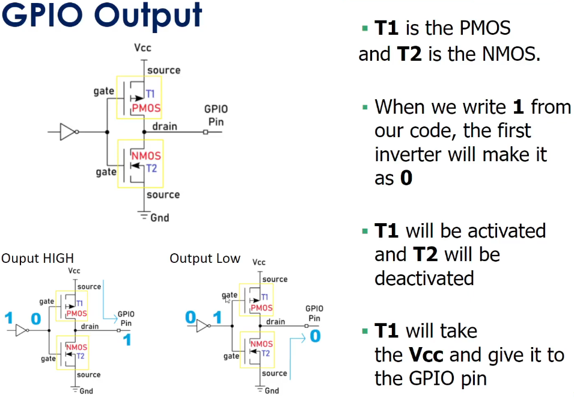

#### **3.2 GPIO Input** 

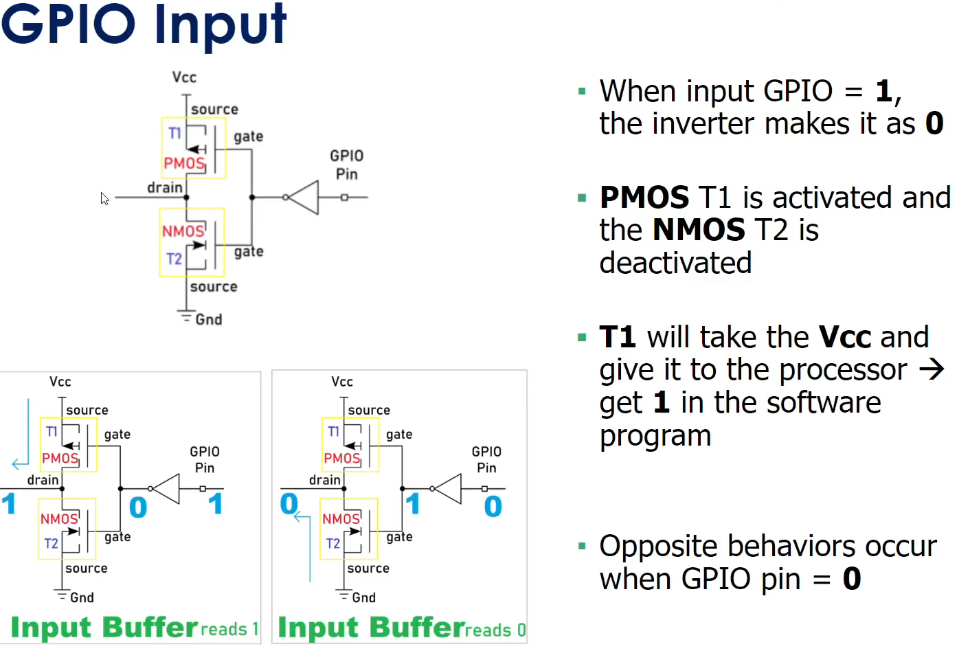

#### **3.3 GPIO Input Modes**

##### **3.3.1 High-impedance or Floating**

*   Bất cứ khi nào vi điều khiển được bật nguồn, các chân GPIO mặc định ở trạng thái đầu vào trở kháng cao.

*   Trạng thái trở kháng cao (High-impedance hoặc HI-Z) của một chân GPIO là trạng thái khi chân đó không được kết nối với mức điện áp cao (VCC) hoặc thấp (GND).

*   Trạng thái của chân trong trường hợp này là không xác định (không thể xác định được mức logic là 0 hay 1) trừ khi nó được kéo lên cao hoặc kéo xuống thấp từ bên ngoài.

*   Trạng thái nổi (floating) có thể dẫn đến dòng điện rò rỉ, dẫn đến tiêu thụ điện năng cao vì một chân nổi rất dễ bị nhiễu và có thể dẫn đến dòng điện rò rỉ.

🡪 Do đó, khuyến nghị nên giữ các chân không sử dụng ở trạng thái kéo lên (pull-up) hoặc kéo xuống (pull-down) để tránh dòng điện rò rỉ.

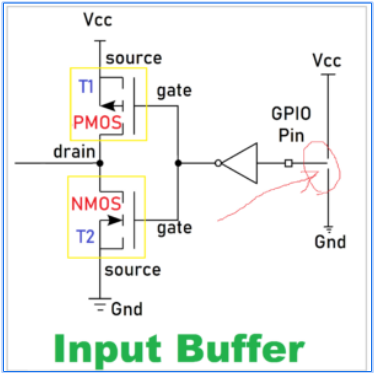

##### **3.3.2 Pull-up**

*   Điện trở kéo lên nội bộ được kết nối với chân. Do đó, trạng thái của chân sẽ là CAO (HIGH) trừ khi sử dụng điện trở kéo xuống bên ngoài.

*   Sẽ có một thanh ghi đặc biệt để kích hoạt điện trở kéo lên nội bộ này trong vi điều khiển (xem tài liệu datasheet).

**Giải thích**:

*   **Điện trở kéo lên nội bộ (Internal pull-up resistor)**: Đây là một điện trở được tích hợp sẵn bên trong vi điều khiển, một đầu được kết nối với chân GPIO, đầu còn lại được kết nối với nguồn điện (VCC).

*   **Trạng thái cao (HIGH)**: Khi điện trở kéo lên được kích hoạt, chân GPIO sẽ được kéo lên mức điện áp cao (VCC), tương đương với mức logic 1.

*   **Điện trở kéo xuống (pull-down resistor)**: Để thay đổi trạng thái mặc định, ta có thể kết nối một điện trở kéo xuống từ chân GPIO về đất (GND). Điều này sẽ kéo mức điện áp trên chân xuống mức thấp (LOW), tương đương với mức logic 0.

*   **Thanh ghi cấu hình**: Vi điều khiển cung cấp các thanh ghi để người dùng cấu hình các tính năng của GPIO, bao gồm cả việc kích hoạt/vô hiệu hóa điện trở kéo lên/kéo xuống.

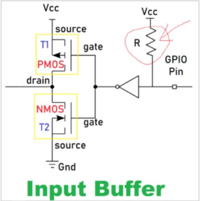

##### **3.3.3 Pull-down**

*   Trong loại này, điện trở kéo xuống nội bộ được kết nối với chân. Do đó, trạng thái của chân sẽ là Thấp (LOW) trừ khi sử dụng điện trở kéo lên bên ngoài.

*   Sẽ có một thanh ghi đặc biệt để kích hoạt điện trở kéo xuống nội bộ này trong vi điều khiển.

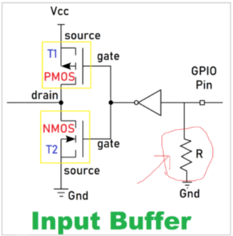

**Giải thích**:

*   **Điện trở kéo xuống nội bộ (Internal pull-down resistor)**: Đây là một điện trở được tích hợp sẵn bên trong vi điều khiển, một đầu được kết nối với chân GPIO, đầu còn lại được kết nối với đất (GND).

*   **Trạng thái thấp (LOW)**: Khi điện trở kéo xuống được kích hoạt, chân GPIO sẽ bị kéo xuống mức điện áp thấp (GND), tương đương với mức logic 0.

*   **Điện trở kéo lên (pull-up resistor)**: Để thay đổi trạng thái mặc định, ta có thể kết nối một điện trở kéo lên từ chân GPIO về nguồn điện (VCC). Điều này sẽ kéo mức điện áp trên chân lên mức cao (HIGH), tương đương với mức logic 1.

*   **Thanh ghi cấu hình**: Vi điều khiển cung cấp các thanh ghi để người dùng cấu hình các tính năng của GPIO, bao gồm cả việc kích hoạt/vô hiệu hóa điện trở kéo xuống.

#### **3.4 GPIO Output Modes**

The GPIO is used to drive the electrical signal (high or low) to the pin when it is configured as a output. There are primarily two configuration options for GPIO outputs:

##### **3.4.1 Push-pull**

*   Trạng thái này là trạng thái mặc định của chế độ đầu ra GPIO. Chân có thể "đẩy" tín hiệu lên cao hoặc "kéo" nó xuống thấp bằng cách sử dụng transistor PMOS hoặc NMOS.

*   Không cần sử dụng điện trở kéo lên hoặc kéo xuống vì các transistor PMOS và NMOS đã thực hiện công việc đó.

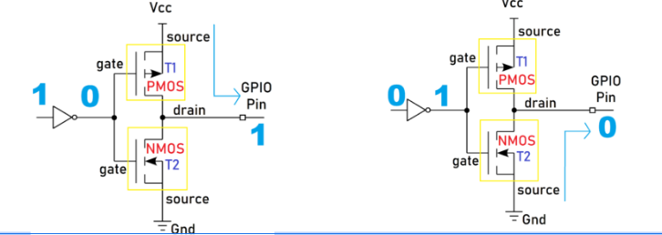

**Giải thích**:

**Chế độ đầu ra GPIO**: Khi một chân GPIO được cấu hình ở chế độ đầu ra, vi điều khiển có thể chủ động điều khiển mức điện áp trên chân đó.

**Transistor PMOS và NMOS**:

*   **PMOS (P-channel Metal-Oxide-Semiconductor)**: Là một loại transistor hiệu ứng trường. Khi áp điện áp âm (hoặc không có điện áp) lên cổng (gate) của PMOS, transistor sẽ dẫn điện, cho phép dòng điện chảy qua.

*   **NMOS (N-channel Metal-Oxide-Semiconductor)**: Là một loại transistor hiệu ứng trường khác. Khi áp điện áp dương lên cổng (gate) của NMOS, transistor sẽ dẫn điện, cho phép dòng điện chảy qua.

**"Push" và "Pull"**:

*   **"Push" (đẩy)**: Khi vi điều khiển muốn đặt mức điện áp cao (HIGH) trên chân GPIO, nó sẽ điều khiển transistor PMOS để cho phép dòng điện chảy từ nguồn điện (VCC) đến chân GPIO.

*   **"Pull" (kéo)**: Khi vi điều khiển muốn đặt mức điện áp thấp (LOW) trên chân GPIO, nó sẽ điều khiển transistor NMOS để cho phép dòng điện chảy từ chân GPIO về đất (GND).

##### **3.4.2 Open-drain**

*   Trong chế độ đầu ra GPIO, bộ đệm đầu ra được hình thành bằng cách sử dụng các transistor PMOS và NMOS. Nếu bạn loại bỏ transistor PMOS, thì đó sẽ là chế độ đầu ra mở (open drain).

*   Tên gọi này xuất phát từ thực tế là cực thoát (drain) của MOSFET không được kết nối với bất kỳ thứ gì bên trong. Nếu bạn sử dụng BJT thay cho MOSFET, thì điều này được gọi là đầu ra thu gom mở (open collector).

*   Khi bạn kích hoạt NMOS, nó sẽ cung cấp kết nối với GND. Chân GPIO sẽ ở mức Thấp.

*   Khi bạn tắt NMOS, chân GPIO sẽ không được kết nối với Vcc hoặc GND. Nó sẽ ở trạng thái nổi. Do đó, đầu ra sẽ ở mức Thấp hoặc trở kháng cao (nổi). Nó có thể kéo chân xuống mức thấp nhưng không thể đẩy nó lên mức cao.

*   Đầu ra mở thường được sử dụng trong các giao tiếp truyền thông nơi nhiều thiết bị được kết nối trên cùng một đường dây (ví dụ: I2C, One-Wire, v.v.). Khi tất cả các đầu ra của các thiết bị được kết nối với đường dây ở trạng thái Hi-Z, đường dây được kéo lên mức logic 1 mặc định bởi một điện trở kéo lên. Bất kỳ thiết bị nào cũng có thể kéo đường dây xuống mức logic 0 bằng cách sử dụng đầu ra mở của nó và tất cả các thiết bị đều có thể nhận thấy mức này.

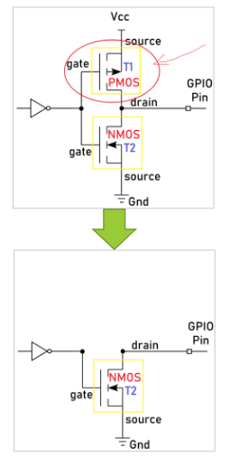

**Giải thích**:

*   **Chế độ đầu ra mở (Open Drain)**: Trong chế độ này, chỉ có transistor NMOS được sử dụng. Điều này có nghĩa là chân GPIO chỉ có thể được "kéo xuống" mức thấp (GND) khi NMOS được kích hoạt. Khi NMOS không được kích hoạt, chân GPIO sẽ ở trạng thái nổi (không được kết nối với nguồn điện).

*   **Ứng dụng của chế độ đầu ra mở**: Chế độ này thường được sử dụng trong các giao tiếp truyền thông như I2C và One-Wire, nơi nhiều thiết bị được kết nối trên cùng một đường dây. Bằng cách sử dụng đầu ra mở, các thiết bị có thể chia sẻ đường dây chung mà không gây xung đột.

*   **Cơ chế hoạt động**: Khi một thiết bị cần truyền dữ liệu, nó sẽ kích hoạt transistor NMOS của mình, kéo đường dây xuống mức thấp. Các thiết bị khác trên đường dây có thể nhận biết sự thay đổi trạng thái này. Khi không có thiết bị nào đang truyền dữ liệu, điện trở kéo lên sẽ kéo đường dây trở lại mức cao.

#### **3.5 Analog Mode**

*   Chế độ này kết nối chân với bộ chuyển đổi analog sang số (ADC) nội bộ và cho phép bạn đọc một giá trị đại diện cho điện áp nhất định tại chân đó.

*   Giá trị phụ thuộc vào độ phân giải của ADC, ví dụ, một ADC 12 bit có thể có giá trị từ 0 đến 4095.

*   Giá trị này được ánh xạ tới một điện áp nằm trong khoảng từ 0V đến (thường là) điện áp mà vi điều khiển đang chạy (ví dụ: 3.3V).

*   Khi một GPIO được cấu hình ở chế độ analog, các điện trở kéo lên/kéo xuống đầu vào sẽ bị ngắt kết nối (nổi).

**Giải thích**:

*   **Chế độ Analog**: Khi một chân GPIO được cấu hình ở chế độ analog, nó sẽ được kết nối với một bộ chuyển đổi analog sang số (ADC) tích hợp bên trong vi điều khiển. ADC là một mạch điện tử chuyển đổi tín hiệu điện áp tương tự (analog) thành tín hiệu số (digital).

*   Đọc giá trị điện áp: Trong chế độ analog, bạn có thể đo được điện áp tương ứng với tín hiệu analog được áp dụng lên chân GPIO.

*   Độ phân giải ADC: Độ phân giải của ADC quyết định độ chính xác của phép đo. ADC 12 bit có thể phân biệt 2^12 = 4096 mức điện áp khác nhau.

*   Ánh xạ giá trị: Giá trị số đọc được từ ADC sẽ được ánh xạ tương ứng với mức điện áp thực tế trên chân GPIO. Ví dụ, nếu điện áp tối đa là 3.3V, giá trị 0 tương ứng với 0V và giá trị 4095 tương ứng với 3.3V.

*   Ngắt kết nối điện trở kéo lên/kéo xuống: Trong chế độ analog, các điện trở kéo lên/kéo xuống thường được ngắt kết nối để không ảnh hưởng đến phép đo điện áp chính xác.

#### **3.6 Alternate Function Mode**

*   Các chân GPIO có khả năng cung cấp một chức năng thay thế ngoài ba chế độ thông thường.

*   Các chân được đa nhiệm để cung cấp các chức năng: chân Rx/Tx của UART, chân I2C, v.v.

*   Sẽ có một thanh ghi riêng biệt để thiết lập các chức năng thay thế.

**Giải thích**:

*   **Chức năng thay thế (Alternate Function)**: Ngoài các chế độ cơ bản như đầu vào (input), đầu ra (output) và analog, nhiều chân GPIO có thể được cấu hình để thực hiện các chức năng đặc biệt khác.

*   **Đa nhiệm (Multiplexing)**: Một chân GPIO có thể được sử dụng cho nhiều mục đích khác nhau. Ví dụ, một chân GPIO có thể được cấu hình làm đầu vào thông thường, hoặc làm chân truyền dữ liệu nhận (Rx) của giao tiếp UART, hoặc làm chân truyền dữ liệu gửi (Tx) của giao tiếp UART, tùy thuộc vào cách cấu hình.

*   **Thanh ghi cấu hình**: Vi điều khiển cung cấp các thanh ghi đặc biệt để chọn chức năng thay thế cho từng chân GPIO. Bằng cách viết giá trị thích hợp vào các thanh ghi này, người dùng có thể cấu hình chân GPIO để thực hiện các chức năng như UART, I2C, SPI, SPI, PWM, ADC, DAC, v.v.

### **4. Blink LED PC13**

*   **Step 1:** Enable the peripheral's clock
*   **Step 2:** Configure the peripheral's functionality
*   **Step 3:** Activate and use the peripheral

#### **4.1 Địa chỉ các thanh ghi**

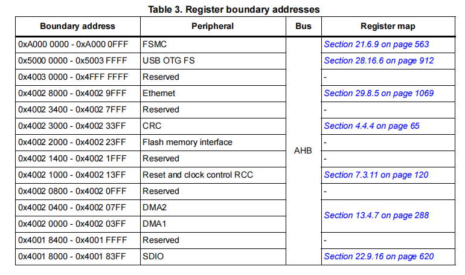

#### **4.2 Enable the peripheral's clock**

*   Tất cả các chân của STM32F103 được nhóm thành nhiều cổng như PORT A, PORT B, PORT C Như có thể thấy từ biểu đồ cấu hình chân trong PA1 là viết tắt của Port A Pin 1. Có 37 chân GPIO trong stm32f103 được chia thành PORT A có 16 chân, PORT B ​​có 16 chân, PORT C có 3 chân và PORT D có 2 chân.

*   Mỗi cổng GPIO có hai thanh ghi cấu hình 32 bit (GPIOx_CRL, GPIOx_CRH), hai thanh ghi dữ liệu 32 bit (GPIOx_IDR, GPIOx_ODR), một thanh ghi thiết lập/đặt lại 32 bit (GPIOx_BSRR), một thanh ghi đặt lại 16 bit (GPIOx_BRR) và một thanh ghi khóa 32 bit (GPIOx_LCKR).

*   Trong tên thanh ghi, x biểu thị cổng mà chân đó thuộc về. Nếu chúng ta đang cấu hình chân PA1 , chân này có Cổng A thì các thanh ghi sẽ được truy cập bởi GPIOA _CRL, v.v.

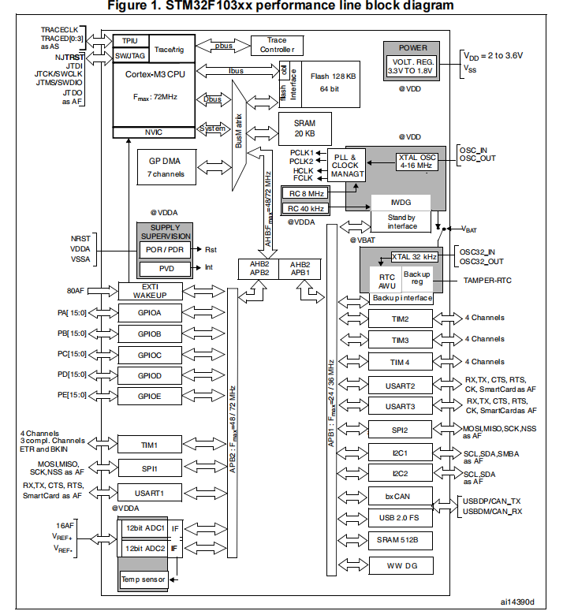


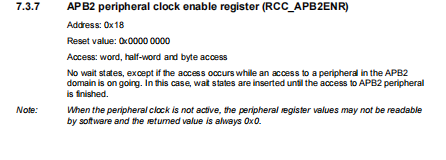

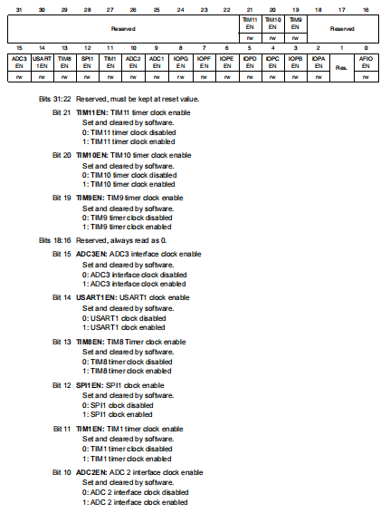

```c
#define RCC_APB2ENR   *(( unsigned int *  )0x40021018)
#define GPIO_CRH      *(( unsigned int *  )0x40011004)
#define GPIO_ODR      *(( unsigned int *  )0x4001100C)

void delay ( unsigned int  timedelay)  {
  for ( unsigned int i = 0; i < timedelay; i++  );

}

int main () {

  RCC_APB2ENR |= ( 1 << 4 );
  GPIO_CRH |= ( 3 << 20 );
  GPIO_CRH &= ~(  3 << 22 );
  
  while (1) {
    GPIO_ODR  |= ( 1 << 13);
    delay (1000000);
    GPIO_ODR  &=  ~( 1 << 13);
    delay (1000000);
  }
}

```

## Contact
Email: individual.thuongnguyen@gmail.com    
GitHub: [github.com/thuongnvLK](https://github.com/thuongnvLK)
